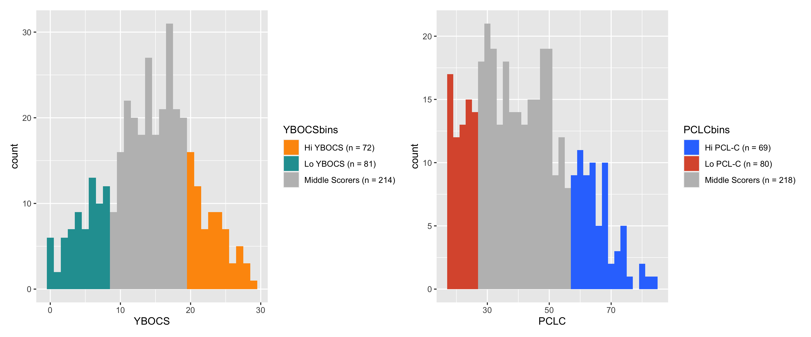

#### Behavioural evidence of suppression-induced forgetting and its interaction with psychological traits

This paper/manuscript consists of two studies: Study 1 replicated the [Think/No-Think paradigm](https://www.nature.com/articles/35066572) and Study 2 examined its interaction with psychological traits.

The raw data for Study 1 is not publicly available due to ethical concerns, but the summary statistics and analyses are presented within this repository.

Study 2 was [prergistered](https://osf.io/zdb8u). The data will be made publicly available and all analyses will be added to this repository.

The histograms of extreme values in Study 2 are displayed below.

#### Python code for data processing
In the Think/No-Think task, we compare the memory of pre-manipulation memorised words with after manipulation. This specific python [code](https://github.com/usman-afzali/Think-No-Think) was used for processing.
